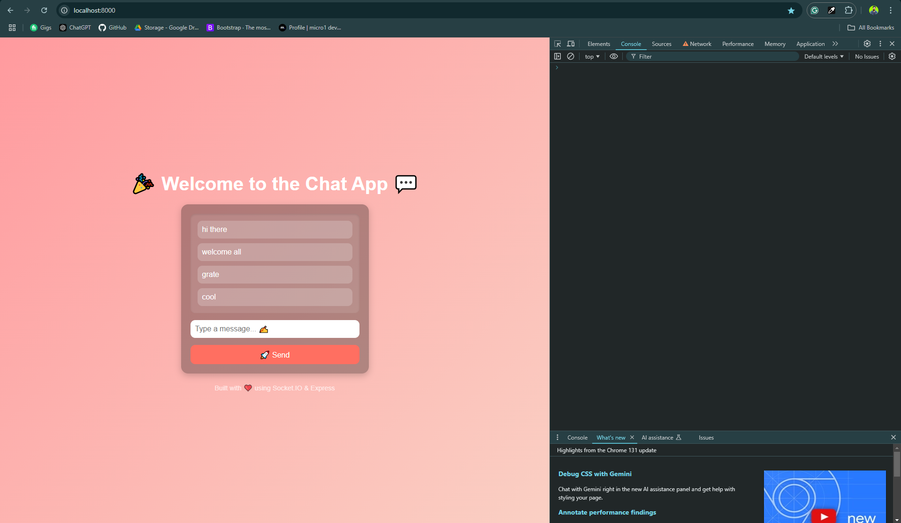

# 🌐 Real-Time Chat Application Backend 💬✨  

This project sets up a **real-time communication server** using **Socket.io** and **Express.js**. With this backend, users can send and receive messages instantly, thanks to two-way communication over WebSockets! 🚀  

## 🛠️ Features  
- **Real-time Communication**: Leveraging Socket.io for seamless two-way message exchange. ⚡  
- **Express Integration**: For serving static files and handling HTTP requests. 🗂️  
- **Dynamic Messaging**: Broadcast user messages to all connected clients in real time. 🔄  

---

## Screen Shots



## 🚀 How It Works  

1. **HTTP and WebSocket Server**:  
   - The app uses an **HTTP server** to upgrade requests from HTTP to WebSocket for real-time communication.  
   - Express serves the static files in the `/public` directory and handles initial HTTP connections.  

2. **Socket.io Magic**:  
   - A `connection` event listener initializes communication with clients.
   - Listens for custom events like `UserMessage` to receive messages.  
   - **Broadcasting**: The received message is emitted to all connected clients.  

---

## 📂 Project Structure  
```
📁 public/            # Static frontend files (e.g., index.html, CSS, JS)
📄 server.js          # Main backend script
```

---

## 📜 Code Breakdown  

### **Backend Logic**
```javascript
const express = require("express");
const http = require("http");
const { Server } = require("socket.io");

const app = express();
const server = http.createServer(app);
const io = new Server(server);

io.on("connection", (socket) => {
    socket.on("UserMessage", (message) => {
        console.log(`The message received: ${message}`);
        io.emit("UserMessage", message); // Broadcast to all clients
    });
});

server.listen(8000, () => {
    console.log("Server listening on:", 8000);
});
```

### **Frontend Integration**  
- Place the frontend files (like `index.html`) in the `/public` directory.  
- Use WebSocket events in the client to interact with this backend.  

---

## 📦 Installation  

1. Clone the repository:  
   ```bash
   git clone <repository_url>
   cd <project_directory>
   ```  

2. Install dependencies:  
   ```bash
   npm install
   ```  

3. Run the server:  
   ```bash
   node server.js
   ```  

4. Open the app:  
   Access the server at [http://localhost:8000](http://localhost:8000).  

---

## 🌟 Built With  

- **Node.js**: Backend runtime environment  
- **Express.js**: Web framework  
- **Socket.io**: Real-time communication library  

---

## 🤝 Contributing  

Want to contribute? Fork the repository and submit a pull request! Your ideas and improvements are welcome.  

---

## 🛡️ License  
This project is licensed under the **MIT License**.  

---

## 📣 Acknowledgments  
Shoutout to all the developers who make real-time communication possible! 🎉  

---

✨ **Happy Coding!** 🎨